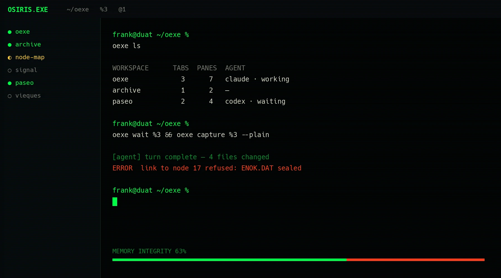

<div align="center">


### OSIRIS.EXE

**档案终端：常驻会话、远程工作、agent。**

<sub>磷光绿 #00FF46 是「信号」，猩红 #FF3A1A 是「网络」；两极只在硬边相接，永不混合。</sub>

<sub>纯 Rust · GPU 渲染基于 Zed 的 gpui · VT 内核来自 Alacritty</sub>

<br />

[](https://github.com/kingpiragua/osiris/actions/workflows/ci.yml)
[](https://github.com/kingpiragua/osiris/releases)
[](https://github.com/kingpiragua/osiris/releases)
[](LICENSE)

<sub>[English](README.md) · 简体中文</sub>

<br />



</div>

## 为什么

- **性能** —— 吞吐约为 Alacritty、Ghostty、Kitty 的 2 倍（[基准测试](#基准测试)）
- **持久会话** —— 退出应用、重启机器后，shell 和已支持的 agent 会话照样运行；无需 tmux
- **编辑器级输入** —— 建议、补全、语法高亮、历史搜索
- **远程开发** —— 文件、仓库、pane 和 git 信息都留在远端机器上
- **原生 SSH** —— profile、SFTP、端口转发和跳板机
- **Agent-aware** —— Claude Code、Codex 等：状态、通知、git 上下文
- **CLI + Skills** —— agent 创建 pane、运行命令、读取输出

## 安装

三平台原生构建都在 [**Releases**](https://github.com/kingpiragua/osiris/releases)：

| | | |
|---|---|---|
| **macOS** | `…-macos-arm64.dmg` · `…-x86_64.dmg` | 拖进「应用程序」 |
| **Windows** | `…-setup.exe` · 便携版 `….zip` | |
| **Linux** | `…-x86_64.AppImage` | `chmod +x` 直接运行，X11/Wayland 依赖已打包 |

## 有什么

| | |
|---|---|
| **编辑器级输入** | 历史影子建议 · 带说明的 Tab 补全 · 语法高亮 · 多行编辑 · 点击定位光标 · <kbd>⌃ R</kbd> 模糊历史搜索 |
| **窗口** | 标签页与分屏 · <kbd>⌘ P</kbd> 命令面板 · <kbd>⌘ F</kbd> 回滚搜索 · 9 套主题 · 输入法 |
| **Agent-aware** | 按 pane 识别 18 个 CLI agent：状态点 · 通知 · 分支 + diff · 重启后续上会话 · 托盘图标提醒需要输入 |
| **远程工作区** | 远端文件、仓库、Changes、diff、worktree、标签页和 pane · 任意客户端重连后原地继续 |
| **CLI + Skills** | 安装包自带 `oexe` CLI · [agent skill](skills/osiris/SKILL.md) · pane/工作区控制 · 真实 PTY 命令 · 输出、进程、端口和 agent 状态 |
| **SSH** | 原生 russh 栈：profile 凭据进 keychain · SFTP 面板 · 端口转发 · 跳板机 · 一次无 sudo 安装 `osiris-server` |

完整文档在 [**`docs/`**](docs/)（英文）——
[快捷键](docs/reference/keyboard-shortcuts.mdx) ·
[config.json](docs/reference/configuration.mdx) ·
[CLI 参考](docs/cli/reference.mdx)。面向 agent 的 CLI 接口另见
[skills/osiris/SKILL.md](skills/osiris/SKILL.md)。

通过以下命令安装 skill：

```sh
npx skills add kingpiragua/OSIRIS.EXE    # 安装
npx skills update OSIRIS.EXE         # 之后更新
```

## 基准测试

同一台机器、同一天、统一 155×40 网格 —— Apple M1 Pro，macOS 26.3.1，
取五次运行的平均值（2026-07-04）：

| | **OSIRIS.EXE** | Alacritty | Ghostty | Kitty |
|---|---:|---:|---:|---:|
| 纯文本 I/O —— 11 MB `cat` <sub>（越低越好）</sub> | **95 ms** | 239 ms | 179 ms | 185 ms |
| [DOOM-fire](https://github.com/const-void/DOOM-fire-zig) 帧率 <sub>（越高越好）</sub> | **888 fps** | 485 fps | 552 fps | 617 fps |
| 冷启动内存 | 116 MB¹ | 105 MB | 128 MB | 130 MB |

<sub>¹ GUI 105 MB + 常驻 server 11 MB。</sub>

测试方法与一键复现脚本：[`scripts/bench/`](scripts/bench/README.md)。

---

<div align="center">
<sub>

基于 [gpui](https://github.com/zed-industries/zed) 与 [`alacritty_terminal`](https://github.com/zed-industries/alacritty) 构建 · [Apache-2.0](LICENSE) · [更新日志](CHANGELOG.md)

</sub>
</div>


## 致谢

OSIRIS.EXE 是 [**tty7**](https://github.com/l0ng-ai/tty7) 的分支，遵循同一份 Apache-2.0 许可证。引擎归上游，档案归我们；改动清单见 [`CONVERSION.md`](CONVERSION.md)。
